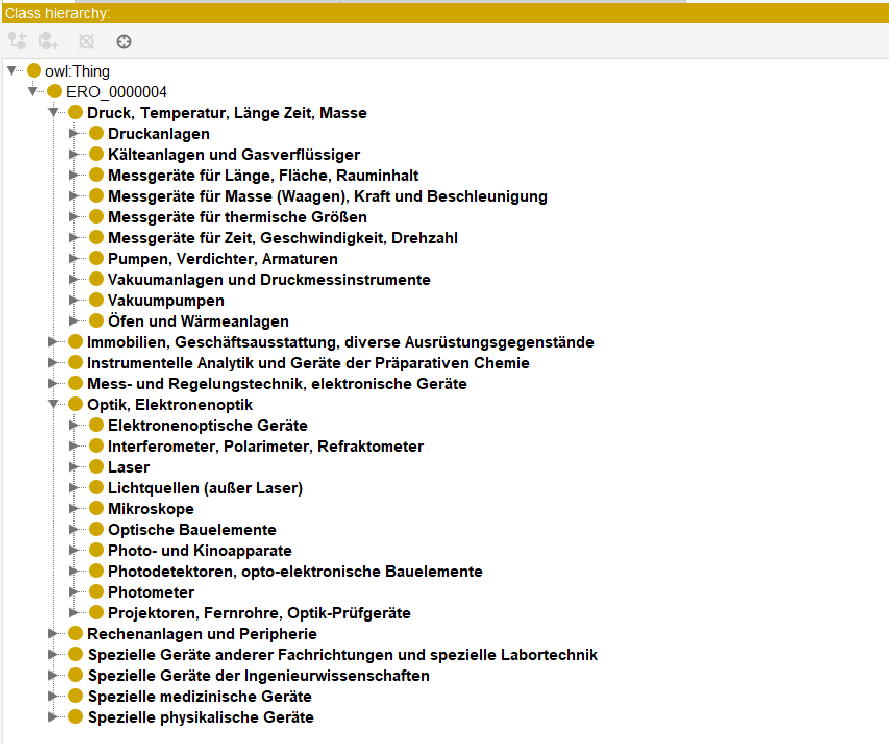

# DFG-Geraetegruppenschluessel / DFG Equipment Group Classification Ontology Extension

The DFG Gerätegruppenschlüssel Ontology (DFG Equipment Group Classification, DFG GGS) provides an optional ontology extension for classifying scientific instruments. It is a formal RDF/OWL representation of a pre-existing classification hierarchy originally published in XLSX format by the [Deutsche Forschungsgemeinschaft](https://www.dfg.de/de/foerderung/foerdermoeglichkeiten/programme/infrastruktur/wgi/geraetegruppenschluessel). Each classification level - H (Hundertergruppen), Z (Zehnergruppen), and E (Einergruppen) - is represented as owl:Class elements, with subclass statements according the hierarchy. Labels are provided in German. This extension may be of interest to VIVO users seeking a structured way to classify instrument types.

# Ontology Extension

**Main features**

- 4517 classes in total, no properties  
- 3-tier hierarchy  
  - H (highest level) - 10 Classes  
  - Z (middle level) - 94 Classes  
  - E (lowest level) - 4413 Classes  
- Nested under Instrument class (currently http://purl.obolibrary.org/obo/ERO_0000004 which will eventually be replaced)  
- German labels

 - prefix: dfgggs  

[DFG GGS Ontology OWL file](ontology/dfgggs_ontology_extension.owl)  
[DFG GGS Ontology TTL file](ontology/dfgggs_ontology_extension.ttl)

  

Sample of the hierarchy in Protege, showing all ten H-level classes and two Z-level groups. 

# How to use the extension  

[How to customize the extension using Protégé](/usage-guides/how-to-customize-using-protege.md)  
[How to import ontology extension into VIVO]() 

# Resources  

[Deutsche Forschungsgemeinschaft Gerätegruppenschlüssel](https://www.dfg.de/de/foerderung/foerdermoeglichkeiten/programme/infrastruktur/wgi/geraetegruppenschluessel)  
[Geraetegruppenschluessel spreadsheet from DFG](/geraetegruppenschluessel.xlsx)  

# Encoding the Ontology Extension  
  
 CSV file, Scripts, workflow, considerations to create OWL/TTL file from spreadsheet 
