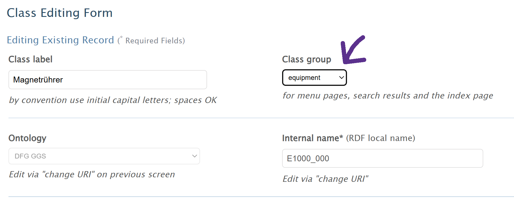

# How to import full or customized extension into VIVO  

**Prerequisites**  

- VIVO account with Site Admin access
- full or custom ontology file (RDF/XML or Turtle) for import

**Steps**  

1. Log into VIVO and navigate to **Site Admin**
2. Under **Advanced Data Tools**, select **Add/Remove RDF data**
3. Upload your chosen ontology file
4. Select **add mixed RDF (instances and/or ontology)**
5. Select file type
6. Click **Submit**  -> next page states "Added RDF from file _____.rdf. Added __ statements."

**Tips**  

- When importing a customized version of the extension, it might be useful to add a label to the owl:Ontology element directly in the file with something like: <rdfs:label xml:lang="en">My Mini Extension</rdfs:label>, or other metadata as seen fit. Some of this can also be done directly in VIVO after import.  
- After import, assign classes to the appropriate class group in order to see instances rendered in those categories. For example, assign the class "Magnetrührer" to the 'equipment' class group, then "Magnetrührer" instances can be displayed in the correct category from the equipment page, as seen here:   
  
   

---  

**Navigate to the class control panel and click 'Edit Class'**:
  
   
  
**Choose 'equipment' from the Class Group dropdown menu, then 'Submit Changes':**  
  
  